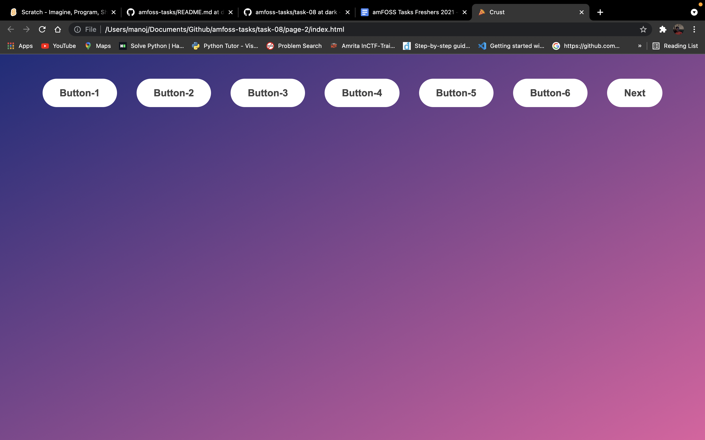
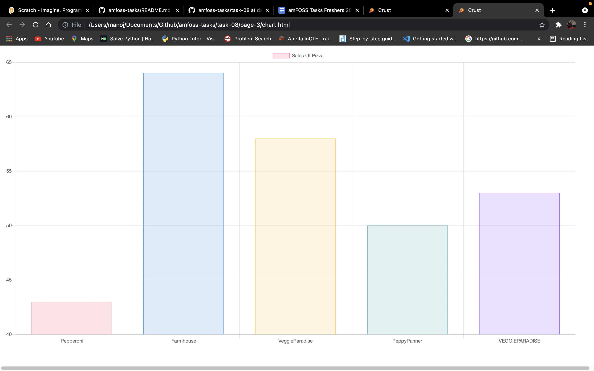

#  JSExplorer
This task was an intresting one and I had explored the how websites are built and how can we change the layout and show various data in them like a table or graph or something.  

# The screenshot of page-1

# The screenshot of page-2

# The screenshot of page-3

# Walkthrough the pages after I had fixed the bugs and done everything required

https://user-images.githubusercontent.com/83648898/141091733-f95f07e8-7a7b-47f9-9fde-665e7c9c9d63.mp4

